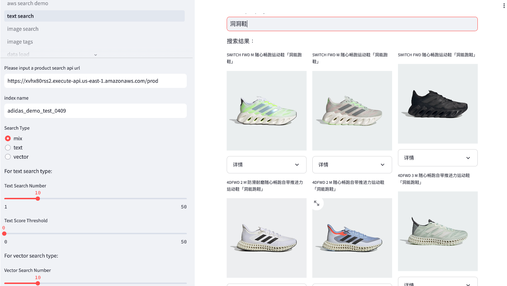
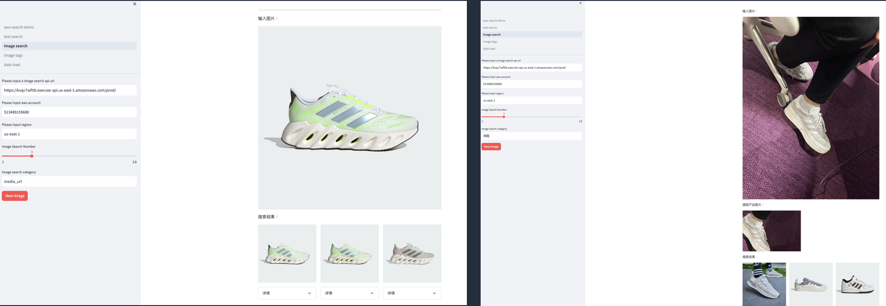
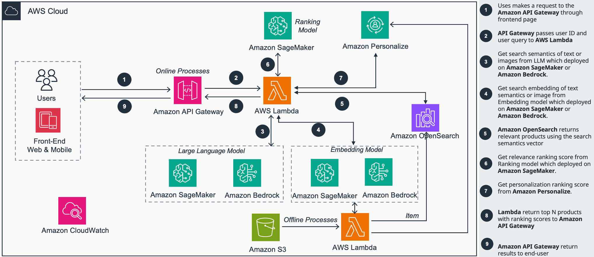
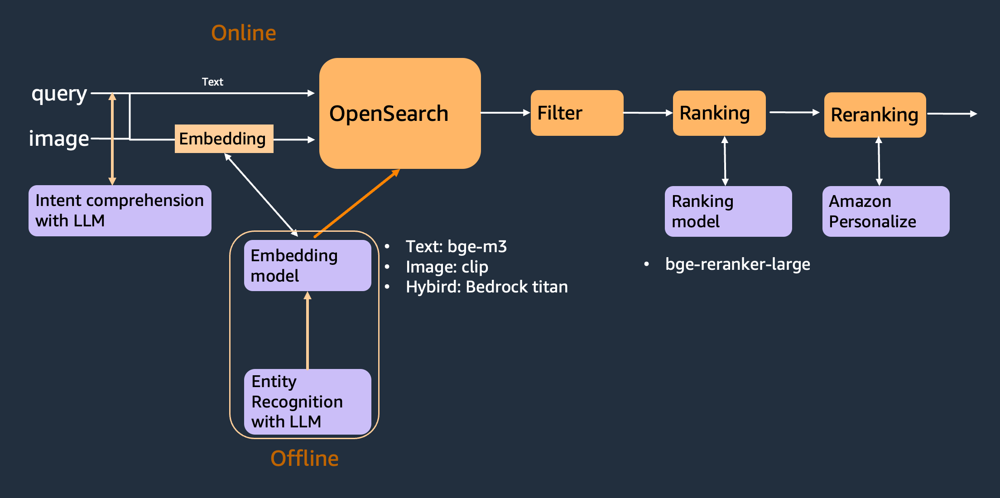

# Intelligent product search with LLM solution on AWS

## Introduction

A product search demo using Amazon Bedrock, Amazon OpenSearch to enhance product search performence.

*Text query search demo


*Image search demo


*Reference Architecture on AWS


*Design Logic



## Overview

This guidance describes how to build intelligent product search guidence with amazon OpenSearch, Embedding model, including keyword search, vector search, image search, reranking and personalize ranking functions.
It offers the following key features:
- Keyword search using bm25
- Vector search using embedding model, such as BGE-m3 or Amazon Titan embedding model
- Reranking search results using reranking model, such as BGE-reranker-large model
- Personalize ranking search results using amazon Personalize services
- Image search using image embedding model, such as CLIP or Amazon Titan multi-modal model
- Multi-modal search using multi modal model, such as Amazon Titan multi-modal model


## Prerequisites

### Operating System
CDK are optimized to best work to be initiated on **<Amazon Linux 2023 AMI>**.  Deployment in another OS may require additional steps.

### AWS account requirements

- IAM role with specific permissions
- Amazon Bedrock
- Amazon Lambda
- Amazon DynamoDB
- Amazon OpenSearch Service
- Amazon Personalize
- Amazon SageMaker (Optional, if you need customized models to be deployed)


### Supported Regions

us-west-2, us-east-1, us-east-2, ap-south-1, ap-southeast-1, ap-southeast-2, ap-northeast-1, eu-central-1, eu-west-1, eu-west-3, or any other region that supports the services (bedrock) used in the Guidance.


## Deployment guide

### 0.Launch EC2 instance

(1)	input name, such as ‘product_search’


(2)	Instance type select t3.large

(3)	Create new Key pair

(4)	In the Network setting, select ‘Allow HTTP traffic from the internet’


(5)	In the configure storge, input ‘20’ GiB


(6)	In the Advanced details, click ‘Create new IAM profile’

    a.In the IAM Role page, click Create role
    
    b.In the Select trusted entity page, select EC2 in the Use case and click next
    
    c.Select role:
        
        •	AmazonS3FullAccess
        
        Create the role
        
    d.Select the role in the IAM instance profile
    


    
(7)	Launch the EC2 and Connect the EC2


(8) download the code from git

```
sudo yum update
sudo yum install git
git clone https://github.com/aws-samples/intelligent-product-search-with-llm.git
```


### 1. Lambda and OpenSearch deployment

Deploy resources with reference to [Resource_deployment_README](https://github.com/aws-samples/intelligent-product-search-with-llm/blob/main/deployment/Resource_deployment_README.md)


### 2. model deployment

In the Amazon SageMaker -> Notebook instances -> SearchGuideNotebook

* open clip_classification_deploy/deploy-clip-model-on-sagemaker.ipynb to deploy the image tagging model

* open clip_image_embedding_deploy/deploy-clip-image-embedding.ipynb to deploy the image search model

* open text_embedding_deploy/bge_m3_deploy.ipynb to deploy the text search model

* open rerank_model_deploy/bge_m3_reranker_deploy.ipynb to deploy the reranker model


### 3. webUI deployment

Deploy webUI with reference to  [UI_deployment_README](https://github.com/aws-samples/intelligent-product-search-with-llm/blob/main/web_ui/UI_deployment_README.md)


### 4. Online data load

In the the web ui page, open data_load page to load data. 


### 5. Offline data load

In the Amazon SageMaker -> Notebook instances -> SearchGuideNotebook

* open data_load/data_load_csv_text.ipynb to load the product information with csv format

* open data_load/data_load_csv_image.ipynb to load the product information inclue image with csv format

* open data_load/data_load_csv_json.ipynb to load the product information with csv json
