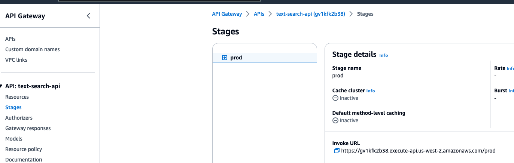
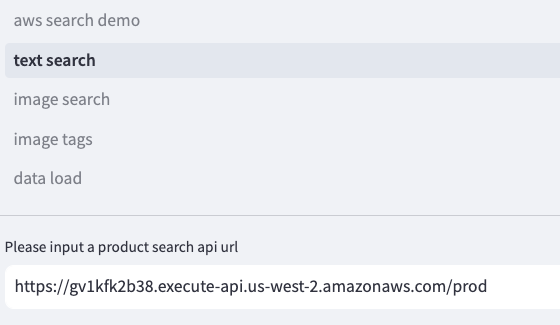
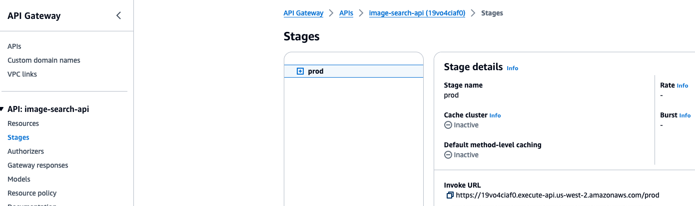
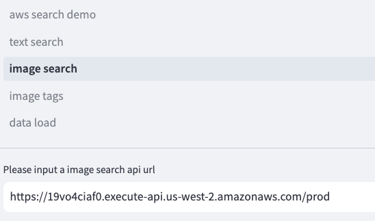
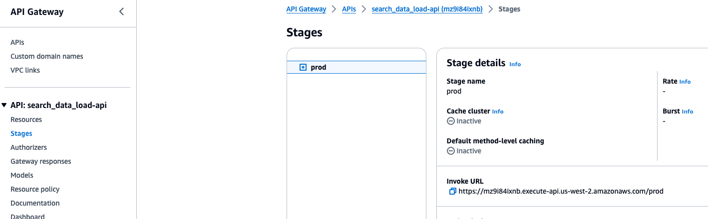
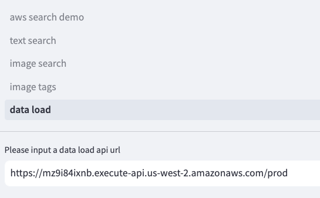

# Deploy streamlit in EC2

### 1.Create EC2 instance

Network settings choose "Allow HTTP traffic from the internet"

### 2.Connect to EC2, install the following dependencies:

```
sudo yum update
sudo yum install nginx
sudo yum install tmux -y
sudo yum install python3-pip
pip install streamlit
```

### 3.Create nginx profiles

```
cd /etc/nginx/conf.d
sudo touch streamlit.conf
sudo chmod 777 streamlit.conf
vi streamlit.conf
```

enter the template:

```
upstream ws-backend {
        server xxx.xxx.xxx.xxx:8501;
}

server {
    listen 80;
    server_name xxx.xxx.xxx.xxx;
    client_max_body_size 100m;

    location / {
            
    proxy_pass http://ws-backend;

    proxy_set_header X-Forwarded-For $proxy_add_x_forwarded_for;
      proxy_set_header Host $http_host;
      proxy_redirect off;
      proxy_http_version 1.1;
      proxy_set_header Upgrade $http_upgrade;
      proxy_set_header Connection "upgrade";
    }
  }
```

Change the xxx.xxx.xxx.xxx to the EC2 private IP.


### 4. start nginx

```
sudo systemctl start nginx.service
```

### 5.Run streamlit ui stript

```
cd /home/ec2-user/aws_product_search_solution/web_ui
tmux
streamlit run aws_search_demo.py
```

### 6.Open ui page

Enter the url in the webpage：http://<EC2 public IP>

### 7.configure the invoke url

(1) copy the text search invoke url from api gateway



paste the invoke url into the webpage api url input box



(2) copy the image search invoke url from api gateway



paste the invoke url into the webpage api url input box



(3) copy the data load invoke url from api gateway



paste the invoke url into the webpage api url input box


